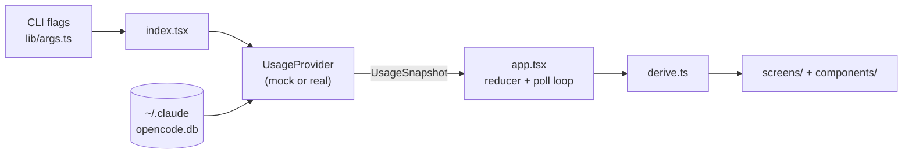

# Architecture

`open-usage` is a terminal UI (Bun + React via `@opentui/react`) that shows plan usage and limits for Claude Code, Codex, and OpenCode Go.

## The 30-second version

1. `index.tsx` reads CLI flags and picks a data source: mock (sample data) or real (your local files). A `daemon` first argument goes to `daemon/` instead and never draws.
2. Both data sources implement one interface, `UsageProvider`, and hand the UI a `UsageSnapshot`.
3. A pure reducer holds all UI state; `derive.ts` turns state + snapshot into render-ready values.
4. `app.tsx` owns the only timers (poll loop, idle watchdog); screens and components just draw.
5. Rule that explains most odd-looking code: Bun leaks native memory on every React re-render, so the app is built to re-render as rarely as possible.

## Commands

| Command | What runs |
| --- | --- |
| `bun run dev` | Real mode with `--watch` reload. |
| `bun run demo` | Sample data with polling disabled. |
| `bun run production` | Real mode with provider polling. |
| `bun run preview` | Headless text frame for reviewing the UI without a terminal session. |
| `bun run shot` | Headless HTML screenshot for reviewing colors and chart geometry. |
| `bun test` | Runs the suite under the top-level `test/` directory. |
| `bun src/index.tsx daemon start` | Starts the background poller against your real config. |
| `bun run typecheck` | Runs `tsc --noEmit`. |

The main UI entry points accept `--mock`, `--real`, `--no-poll`, `--screen`, `--view`, and `--mode`.

## Module tour

Each entry: what it does, and when you would open it.

### Entry layer

**`src/index.tsx`**
Parses flags, picks the provider, creates the terminal renderer, mounts `<App>`.
Also installs SIGHUP/SIGINT/SIGTERM and stdin-close handlers that exit the process.
OpenTUI's own handlers never exit, which once left orphaned sessions polling for days, so do not remove these.
Touch when: adding a CLI flag or changing startup wiring.

**`src/lib/args.ts`**
Tiny flag parser (`--flag`, `--flag=value`, `--flag value`) plus helpers that turn flags into startup options.
Touch when: adding a CLI flag.

**`src/config.ts`**
App name, version, poll interval.

### Data layer (`src/data/`)

**`types.ts`** - the most important file in the repo.
Defines `UsageProvider` (what a backend must supply) and `UsageSnapshot` (everything the UI renders: per-provider limits, scopes, burn rate, 30-day series).
The UI never imports from `real/` or knows where data came from.
Touch when: the UI needs a new piece of data; add it here first, then fill it in both providers.

**`mock-provider.ts`**
A hand-written `UsageSnapshot` with rich sample figures and a fake 1.6s refresh delay.
This is what `bun run demo` shows.
Touch when: designing new UI that needs sample data to look right.

**`real-provider.ts`**
The composer: calls every reader in `real/`, hydrates the persisted limit cache, passes their outputs to the three provider builders, and combines the results into a `UsageSnapshot`.
It owns paths, connection state, refresh polling, timestamps, persistent cache writes, and provider selection.
It also owns fallback logic: no local sources found means mock data with a visible "sample data" banner.
Touch when: changing source wiring, refresh behavior, or fallback selection.

**`real/claude-provider.ts`**, **`real/codex-provider.ts`**, **`real/go-provider.ts`**
Each file owns one provider's metadata and pure `ProviderUsage` assembly.
Claude owns statusline limits, projection, notice, scopes, burn, and transcript footer.
Codex owns app-server limits, window labels, plan metadata, scopes, and summary footer.
OpenCode Go owns server-versus-spend selection, estimate labeling, limit rows, scopes, and footer.
Touch one of these when changing how that provider's data is presented.

One invariant holds all three together, in two parts.

**Basis is absolute.** `ProviderUsage.series` is always the blended count - fresh input plus output plus cache writes, cache reads excluded - so the overview can put the providers on one axis and mean it.

**Population may widen only if the source can express that basis exactly.** A source reporting every token kind separately may cover more than this device, and sets `seriesScope` to say so. One that reports a single pre-blended number cannot, and is reported as its own labelled figure on that provider's detail screen instead.

The two cases that forced the rule sit on opposite sides of it.
Codex's app-server reports account-wide daily tokens as one opaque figure that counts cached input, about 17x its local blended figure, and no breakdown comes with it - so it stays off the axis and appears as `account 30d · incl. cached` in the codex records section.
OpenCode Go's dashboard reports every kind separately, so its workspace-wide history can be blended exactly and does fill `series`, labelled `workspace`.

**`real/provider-helpers.ts`**
Small display helpers shared by at least two provider builders: cap-less rows, reset text, token formatting, and local burn state.
Touch when a shared provider presentation primitive changes.

**`real/` - one reader per local source, all pure and path-injected:**

| Reader | Source file | Produces |
| --- | --- | --- |
| `opencode-db.ts` | `~/.local/share/opencode/opencode.db` | Token counts per provider per hour (SQL over message rows) |
| `opencode-auth.ts` | `~/.local/share/opencode/auth.json` | Which credentials exist, already masked |
| `claude-transcripts.ts` | `~/.claude/projects/` | Claude token counts bucketed by hour |
| `claude-history.ts` | `~/.claude/history.jsonl` | Prompt and session counts, last 30 days |
| `statusline-snapshot.ts` | `~/.claude/usage-snapshot.json` | The actual limit percentages (5h and 7d windows) plus a trend tracker |
| `usage-cache.ts` | `~/.config/open-usage/usage-cache.json` | Last successful Claude, Codex, and OpenCode Go limit readings for startup display |
| `claude-account-usage.ts` | `~/.claude.json` | The account's real credit spend, cap and balance (`cachedUsageUtilization`) |
| `spend-store.ts` | `~/.config/open-usage/spend-history.json` | Our own record: spend cycles as a high-water mark, tokens per day per model |
| `pricing.ts` | shipped table + `~/.config/open-usage/pricing.json` | Per-model rates, used only to apportion an exact total or to label an estimate |
| `claude-spend.ts` | - | Assembles the two into the `SpendSummary` the detail screen renders |
| `aggregate.ts` | - | Shared time bucketing and formatting helpers (`formatCountdown`, `seriesFromBuckets`, ...) |
| `json.ts` | - | The shared `isRecord` guard for parsing unknown JSON |

Every reader takes its file path as a parameter, which is why tests can feed fixtures and never touch your home directory.

**`mask.ts`**
Masks credentials for display: 24 chars or shorter become all bullets, longer keeps first and last 4.

### Daemon layer (`src/daemon/`)

Off unless started. It exists so the persisted usage cache can be current before anyone opens the dashboard.

**`cli.ts`**
Parses `daemon <start|stop|restart|status|logs|run>`, builds the one `DaemonHost` that touches the real world (spawn, signal, liveness, log rotation), and hosts `run` - the foreground loop a supervisor or the spawned child executes.
`selfCommand()` is how a run re-invokes the app: a compiled binary is its own runtime, which Bun marks by serving the entry from `/$bunfs`, while a source checkout needs Bun plus the entry path.
A running daemon rotates its own log by copying it aside and truncating in place, because the stdout fd `start` handed it would follow a rename; a stdout that is not that file - a supervisor's pipe, a shell redirect - is left to whoever owns it.
Touch when: adding a subcommand or changing how the daemon is launched.

**`lifecycle.ts`**
`start`, `stop`, `restart`, `status` as pure logic over an injected `DaemonHost`, which is why none of it spawns or sleeps directly and all of it is tested with fakes.
The rule that shapes it: a state record only counts while the pid it names is alive, so a crashed daemon leaves debris rather than a lie.
A pid is not an identity though - pids are recycled - so a record that claims to predate the last boot is debris too, which keeps `stop` from signalling a stranger.
`start` waits for the child to publish its own record, which is what distinguishes "started" from "died on boot".

**`runtime.ts`**
The loop: refresh every provider, record the outcome, sleep, repeat until aborted.
Failures are recorded and slept through - a laptop that spends the night offline should find a working daemon in the morning.
A resolved `refresh` is not proof that anything reached a server: the provider swallows a source failure so one dead endpoint cannot sink the local read, so the daemon reads the connection statuses back and reports whichever came out `expired`.
It stands down if the state record comes to name another pid, so two daemons never poll one account.

**`state.ts`**
`~/.config/open-usage/daemon.json`: pid, interval, last poll, last success, last error, log path.
Written through a sibling file under the same `withFileLock` the usage cache uses.

The daemon and the dashboard share one cache, so they must not share the work.
`polled-source.ts` anchors its automatic cadence on the reading it was seeded with, which means opening the app while the daemon runs costs no extra requests.
That anchor deliberately does not apply to `r`: the manual floor exists to stop a held key from flooding an API, not to sit out the first press.

### State layer (`src/state/`)

**`app-state.ts`**
All UI state in one struct (`AppState`: view, mode, scope, filter, onboarding wizard, settings cursor, connections) and one pure reducer over ~30 action types.
No timers, no filesystem, no terminal, which is why `test/state/app-state.test.ts` can test it directly.
Touch when: adding any new interaction or piece of UI state.

**`derive.ts`**
Pure function from state + snapshot to render-ready values: which providers are visible/live/hot, provider pressure and the ranking built on it, chart series for the chosen range, alert text.
Pressure is a provider's tightest capped limit whatever window it covers, so a monthly cycle counts even though `scopes` only carries session and weekly.
Touch when: changing what a screen displays without changing what the user can do.

**`actions.ts`**
The `AppActions` interface: every operation a key press or mouse click can trigger.
Screens receive this instead of raw `dispatch`, so keyboard and mouse always resolve to identical behavior.

### UI layer

**`app.tsx`** - the only component with side effects.
Owns the snapshot state, the reducer, the 60s poll loop (skipped when `isPollingEnabled` is false), the 24h idle watchdog, and all keyboard/paste handling.
Everything below it is a pure function of props.
Touch when: adding a key binding or changing app lifecycle.

**`screens/`** - one file per view:

| Screen | Shows |
| --- | --- |
| `overview.tsx` | Mode switcher that delegates to simple or detailed |
| `overview-simple.tsx` | One plan-usage chart plus provider legend |
| `overview-detailed.tsx` | Provider cards, summary trio, usage share, daily split; stacks columns on narrow terminals |
| `provider-detail.tsx` | All limits, token chart, and notices for one provider |
| `settings.tsx` | Connection rows, credentials, display toggles |
| `onboarding.tsx` | Three-step wizard: pick providers, paste credential, summary |
| `help-overlay.tsx` | Modal keymap reference over a dimmed scrim |

**`components/`** - shared building blocks:
`primitives.tsx` (width-exact `Line`/`SplitLine`/`Chart` with mouse hit-ranges), `chrome.tsx` (header, tabs, filter bar, status bar), `limit-meter.tsx` (the percent bars), `toggle.tsx` (segmented controls).

**`lib/`** - pure layout math, no React:
`chart.ts` (bars, sparkline, stacked bar, resampling, period-over-period delta), `meter.ts` (fill and severity color), `text.ts` (grapheme-safe width, pad, truncate via `Bun.stringWidth`).

**`hooks/`** - the only per-second re-renders in the app, deliberately quarantined:
`use-seconds-since.ts` ("updated Xs ago", ticks 1s then coarsens to 10s), `use-blink.ts` (cursor blink).

**`theme.ts`**
Every color, the 70%/85% warn/danger thresholds, spinner frames, chart ramp.

### Dev harnesses (`scripts/`)

`preview.tsx` renders a frame headlessly and prints it as text; `shot.tsx` renders an HTML pixel screenshot.
Both default to mock data.

## Trace: what happens when you press `r`

1. `app.tsx` keyboard handler dispatches `refresh()`.
2. `refresh()` creates an `AbortController`, dispatches `refresh-start` (reducer sets `isRefreshing`), and calls `provider.refresh(signal)`.
3. Real provider re-reads every local file and builds a fresh `UsageSnapshot`; mock provider waits 1.6s and returns its sample.
4. On resolve: `setSnapshot(next)` plus `refresh-success`; on failure the header shows "refresh failed"; a quit mid-flight aborts the signal so nothing lands after unmount.
5. `deriveState` recomputes, screens re-render once.

The 60s poll loop is just this same `refresh()` on a timer, and `--no-poll` removes the timer, nothing else.

## The memory-leak invariants

Bun 1.3.14 leaks a few KB of native memory on every React commit (oven-sh/bun#27514), so re-render frequency is a resource budget.

1. Timer-driven display state lives only in leaf components (`hooks/`), so a tick re-renders one line, never the tree.
2. Callback identities stay stable: `quit` reads session data through a ref; `actions` is memoized on stable deps.
3. Abandoned sessions exit: signal handlers in `index.tsx`, 24h idle watchdog in `app.tsx`.

Any change that adds per-tick state to `App` or the reducer reintroduces the leak.

## Where to make common changes

| I want to... | Touch |
| --- | --- |
| Add a key binding | `app.tsx` (handler) + `actions.ts` + `app-state.ts` (action) + `help-overlay.tsx` (document it) |
| Show new data from a local file | `real/` reader + `real-provider.ts` + `types.ts` + matching sample in `mock-provider.ts` |
| Change colors or thresholds | `theme.ts` |
| Add a screen | `screens/` + `ViewKey` in `app-state.ts` + render branch in `app.tsx` |
| Add a daemon subcommand | `daemon/cli.ts` (dispatch + help) + `daemon/lifecycle.ts` (behavior) |
| Change wording of a limit line | `real-provider.ts` (real) and `mock-provider.ts` (sample) |
