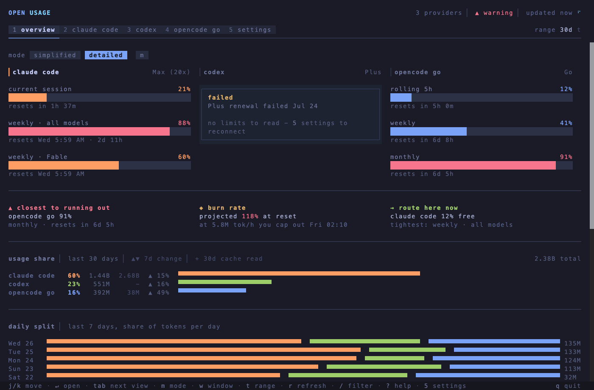

# open-usage

Unified AI plan usage for Claude Code, Codex, and OpenCode Go, in your terminal.

[](https://www.npmjs.com/package/open-usage)
[](https://github.com/arionrefat/open-usage/actions/workflows/ci.yml)
[](LICENSE)

If you pay for more than one AI coding plan, you have no single place to see how much of each is left.
`open-usage` reads what you have already installed and shows every limit on one screen, so you know which agent to reach for before you hit a wall.



## Install

```bash
bun install -g open-usage
```

Then run `open-usage`.

To try it without installing anything:

```bash
bunx open-usage
```

`open-usage` is built with Bun, so Bun is the natural way to install it - but it is not a requirement.
The package is a small launcher that fetches one prebuilt binary for your platform, and that binary embeds Bun.
So npm, pnpm, and yarn work exactly as well, on a machine with no Bun at all:

```bash
npm install -g open-usage      # or: pnpm add -g / yarn global add
npx open-usage                 # one-off, no install
```

### Standalone binary

Download the binary for your OS from the [releases page](https://github.com/arionrefat/open-usage/releases):

```bash
chmod +x open-usage-darwin-arm64
./open-usage-darwin-arm64
```

Supported platforms: macOS (Apple Silicon), Linux (x64, arm64), Windows (x64, arm64).

On macOS, Gatekeeper quarantines binaries downloaded through a browser.
Clear it with `xattr -d com.apple.quarantine open-usage-darwin-arm64`, or install through a package manager instead.

## Usage

```bash
open-usage
```

The first launch runs a short setup wizard that detects which agents you have installed.
After that it opens straight to the overview.

```bash
open-usage --view claude      # jump to a provider
open-usage --mode simple      # fewer numbers per screen
open-usage --no-poll          # read once, never refresh
open-usage --help
```

### Keys

| Key     | Action                                          |
| ------- | ----------------------------------------------- |
| `1`–`5` | jump to a view; `5` is settings                 |
| `tab`   | cycle views forward                             |
| `j`/`k` | move between providers                          |
| `↵`     | open the selected provider                      |
| `m`     | overview mode: simplified / detailed            |
| `w`     | window: session / weekly (simplified mode only) |
| `t`     | cycle range: today / 7d / 30d / month           |
| `r`     | refresh all providers                           |
| `/`     | filter providers by name                        |
| `o`     | re-run the setup wizard                         |
| `?`     | keymap                                          |
| `q`     | quit                                            |

Every control is also clickable, and the mouse wheel scrolls views taller than the terminal.

### Staying current

When a newer version has been published, the header says so:

```
OPEN USAGE                    v0.4.0 available ▏ 3 providers ▏ ✓ all clear ▏ updated now
```

Update with the same command that installed it - `bun install -g open-usage@latest`, or the npm, pnpm or yarn equivalent.
The check runs at most once a day, and [Configuration](#configuration) below covers switching it off.

## What it reads

| Provider    | Limits from                          | History from                       |
| ----------- | ------------------------------------ | ---------------------------------- |
| Claude Code | the signed-in `claude` CLI           | `~/.claude` transcripts            |
| Codex       | a sandboxed `codex app-server`       | `~/.codex/sessions`                |
| OpenCode Go | local estimate, or the dashboard cookie | `opencode.db`                   |

Those three are what ships today.
More providers are planned, so if a plan you pay for is missing, [open an issue](https://github.com/arionrefat/open-usage/issues) and say which one.

### Spend

The Claude Code screen also answers what a month cost, and where the money went.

Where Claude reports real money it is used as-is: `~/.claude.json` carries the account's credit spend, the monthly cap, and the remaining balance.
That figure is labelled `exact` and is never recomputed.

Where Claude reports no money - a subscription with usage credits switched off - the tokens are priced against a shipped rate table and the figure is labelled `est`, alongside the date the prices were taken.
Override any rate in `~/.config/open-usage/pricing.json`; a model with no published price is listed as unpriced rather than counted as free.

The per-model split is an apportionment, not a second opinion.
When an exact total covers the same window, each model's share is scaled to it, so the rows always add up to the headline and a stale price can move the split but never the total.

Claude keeps neither history: transcripts are pruned at `cleanupPeriodDays` (30 by default) and the account block reports only the window you are in.
So `open-usage` keeps its own record in `~/.config/open-usage/spend-history.json`, written from the day it is first run.
Month one answers this month; by month four it answers all four.
A month from before that file existed is shown as not recorded, never as zero.

`open-usage` is read-only, and there is no account to create and no key to paste.
It reuses the logins your CLIs already have: Claude and Codex limits come from their own signed-in CLIs, so their credentials are never read.
The one credential file it opens is OpenCode's `auth.json`, and only to show connection status - the key is masked on read and never displayed, logged, or sent anywhere.
It also reads `~/.claude.json`, but only the `cachedUsageUtilization` block Claude Code caches there, which is how the spend figures stay first-party; nothing else in that file is parsed, and no token in it is read.

Nothing is written outside its own config directory, and there is no telemetry or analytics of any kind.
It makes two outbound requests of its own accord.
One is to `opencode.ai`, and only if you opt in by configuring the cookie below.
The other asks `registry.npmjs.org` whether a newer version has been published, so an installed copy can tell you it is out of date - it sends nothing but the request, caches the answer for a day, gives up after 1.5 seconds, and stays silent on any failure.
Set `OPEN_USAGE_NO_UPDATE_CHECK` to switch it off.

OpenCode Go does not publish per-account limits, so its percentages are local estimates and are labelled as such in the UI.
[Exact OpenCode Go limits](#exact-opencode-go-limits) below covers the optional cookie that replaces them with the dashboard's own figures.
[docs/PROVIDERS.md](docs/PROVIDERS.md) explains how each number is derived.

## Configuration

Settings live in the app, on the `5` screen.
They persist to `~/.config/open-usage/preferences.json` (or `$XDG_CONFIG_HOME/open-usage/`).

| Variable                     | Purpose                                        |
| ---------------------------- | ---------------------------------------------- |
| `XDG_CONFIG_HOME`            | relocate the config directory                  |
| `CODEX_HOME`                 | non-default Codex home                         |
| `OPENCODE_DB`                | non-default `opencode.db` path, for history    |
| `OPEN_USAGE_OPENCODE_COOKIE` | exact OpenCode Go windows, no install needed   |
| `OPEN_USAGE_NO_UPDATE_CHECK` | set to anything to stop the daily version check |

### Exact OpenCode Go limits

OpenCode publishes Go plan usage to its dashboard but not to any public API, so the exact numbers sit behind your signed-in `opencode.ai` session.
Hand `open-usage` that session cookie and the Go card swaps its local estimate for the dashboard's own rolling, weekly, and monthly figures.

1. Sign in at [opencode.ai](https://opencode.ai) and open the dashboard.
2. Open devtools and find the cookie store: **Application → Cookies** in Chrome and Edge, **Storage → Cookies** in Firefox and Safari.
3. Select `https://opencode.ai` and copy the value of the `auth` cookie - `__Host-auth` if that is the name your browser holds.
4. Give it to `open-usage`, either in `~/.config/open-usage/config.json` - a file you create, separate from `preferences.json`:

   ```json
   { "opencodeCookie": "auth=<value>" }
   ```

   or per-shell:

   ```bash
   export OPEN_USAGE_OPENCODE_COOKIE='auth=<value>'
   ```

The config file is re-read on every poll, so a cookie pasted there lands within a minute - press `r` to skip the wait.
The environment variable is read once at launch, so exporting it means restarting the app.

The cookie is optional, and it is also sufficient on its own.
Without it the Go card still works, on the local estimate; with it, OpenCode need not be installed at all, though a machine with no `opencode.db` has no token history to chart and the card says so.

Only the `auth` / `__Host-auth` pair is ever sent, and anything else in a pasted header is stripped before the request leaves your machine.
The cookie carries its own expiry, and the card warns you through its final seven days and again once it lapses, so a dead session cannot quietly pass for a live one.
If the dashboard changes shape underneath it, the card falls back to the estimate with a note rather than showing a figure it can no longer stand behind.

Treat the value like a password: it is a full dashboard credential, not a usage-scoped token.
Prefer the config file over the environment variable to keep it out of your shell history, never paste it into a bug report, and know that nobody should ever ask you for it.
This is deliberately a manual step - `open-usage` never reads your browser's cookie jar for you.

## Development

Requires [Bun](https://bun.sh) 1.0 or newer.

```bash
git clone https://github.com/arionrefat/open-usage.git
cd open-usage
bun install
bun run demo      # sample data, no polling
bun dev           # real data, file watching
```

```bash
bun run typecheck
bun test
bun run build     # compile a standalone binary into dist/
```

Two headless harnesses render screens without a TTY, which is what the layout tests use:

```bash
bun run preview --view claude --width 140          # text only
bun run shot out.html "wide:--mode detailed"       # colour, via canvas
```

[ARCHITECTURE.md](ARCHITECTURE.md) covers the module layout and state model.

## Releasing

Releases are tag-driven from `main`.
CI runs typecheck, tests, and a render smoke test on every push and pull request.

```bash
bun run version:set 0.4.0     # bumps the root and platform versions together
git commit -am "Release v0.4.0"
git push origin main
git tag v0.4.0 && git push origin v0.4.0
```

The `v*` tag builds a binary per platform, publishes the five `@open-usage/*` platform packages and then `open-usage` itself, and attaches the binaries to a GitHub release.

[docs/RELEASING.md](docs/RELEASING.md) covers the npm scope, token, and provenance setup the first release needs.

## License

[GPL-3.0-only](LICENSE)
