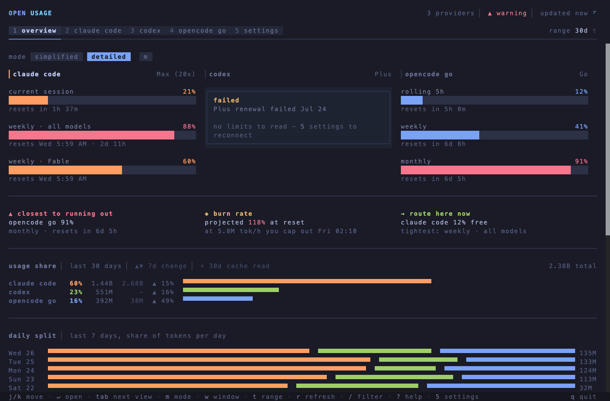

# open-usage

Unified AI plan usage for Claude Code, Codex, and OpenCode Go, in your terminal.

See limits, reset times, token history, and spend in one place.
`open-usage` reuses the tools and logins already on your machine, stays read-only, and has no telemetry.

[](https://www.npmjs.com/package/open-usage)
[](https://github.com/arionrefat/open-usage/actions/workflows/ci.yml)
[](LICENSE)



## Features

- Unified overview - see every plan, usage window, and reset time on one screen.
- Live limits - read current Claude Code and Codex limits through their signed-in CLIs.
- Usage history - compare activity across providers over today, 7 days, 30 days, or the current month.
- Claude spend - show exact account spend when available, with clearly labelled estimates otherwise.
- OpenCode Go - use a local estimate by default or opt in to exact dashboard limits.
- Terminal UI - keyboard and mouse controls, detailed and simplified views, and responsive layouts.
- Background refresh - keep the cache current with an optional daemon.
- Limit notifications - get a desktop notification when a limit runs out, and another when it resets.
- Local by default - no account to create, no key to paste, and no telemetry.

## Install

```bash
npm install -g open-usage
```

Then run `open-usage`.

Bun, pnpm, and yarn work too:

```bash
bun install -g open-usage
pnpm add -g open-usage
yarn global add open-usage
```

To try it without installing:

```bash
npx open-usage
```

Prebuilt binaries for macOS Apple Silicon, Linux x64 and arm64, and Windows x64 and arm64 are also available from [Releases](https://github.com/arionrefat/open-usage/releases).

## Using it

1. Run `open-usage` and complete the short setup wizard.
2. Press `1`-`5` to jump between views, `tab` to cycle, and `j`/`k` to move between providers.
3. Press `r` to refresh, `?` for the full keymap, and `q` to quit.
4. Run `open-usage --help` for startup options.

To keep usage ready in the background:

```bash
open-usage daemon start --interval 5
open-usage daemon status
open-usage daemon stop
```

The daemon is off until you start it and does not survive a reboot on its own.

Limit notifications are offered during setup and can be switched with `n` in settings.
They arrive while the dashboard is open, or from the daemon while it runs.
The dashboard sends them through your terminal when it supports notifications, and through the system notifier otherwise.

## Data and privacy

| Provider | Limits | History |
| --- | --- | --- |
| Claude Code | Signed-in `claude` CLI | Local `~/.claude` transcripts |
| Codex | Sandboxed `codex app-server` | Local `~/.codex/sessions` |
| OpenCode Go | Local estimate or optional dashboard session | Local `opencode.db` |

`open-usage` never modifies another tool's files or reads Claude and Codex credentials.
Exact OpenCode Go limits are optional and require a manually supplied dashboard session cookie.
See [Provider details](docs/PROVIDERS.md) for setup, data sources, calculations, and privacy notes.

## Building from source

Requires [Bun](https://bun.sh) 1.0 or newer.

```bash
git clone https://github.com/arionrefat/open-usage.git
cd open-usage
bun install
bun run demo
```

Use `bun dev` with your real local data.
Run `bun test`, `bun run typecheck`, and `bun run build` to verify a change.

[ARCHITECTURE.md](ARCHITECTURE.md) covers the module layout and state model.
[docs/RELEASING.md](docs/RELEASING.md) covers the release process.

## License

[GPL-3.0-only](LICENSE)
